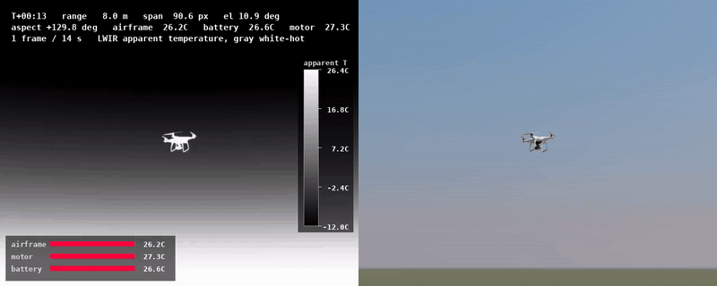
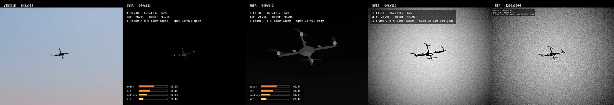
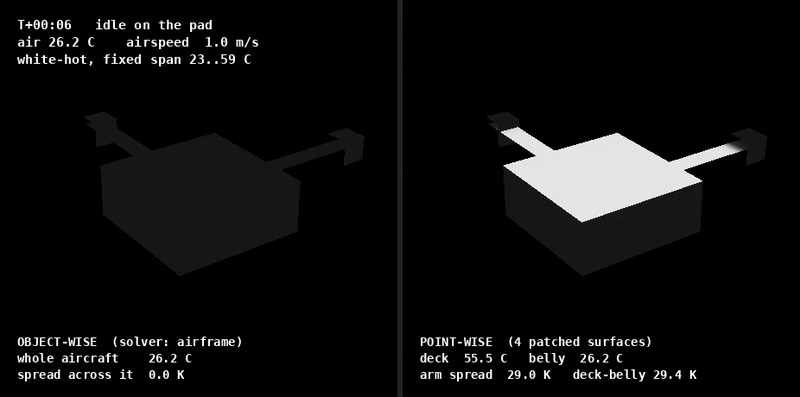
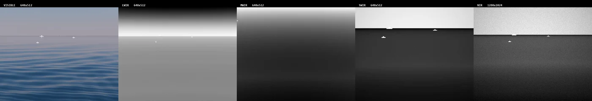

# irsim — a physically-based infrared camera simulator

<p align="center">
  
</p>
<p align="center"><em>A DJI Phantom 4 Pro in flight: the simulated LWIR camera (left) and the visible
camera (right), the same moments through both lenses. Motors, battery and airframe each have their own
temperature.</em></p>

<p align="center">
  <a href="https://reza-shahriari.github.io/isaac-thermal-camera-simulation/"><b>Project site &amp; gallery</b></a> ·
  <a href="TECHNICAL_REPORT.md">Technical report</a> ·
  <a href="docs/physics-model.md">Physics model</a> ·
  <a href="docs/roadmap.md">Roadmap</a> ·
  <a href="CHANGELOG.md">Changelog</a>
</p>

---

**irsim** renders what a real infrared camera would see — thermal (LWIR), mid-wave (MWIR),
short-wave (SWIR) and near-infrared (NIR) — inside **NVIDIA Isaac Sim**. It doesn't just make images
that look thermal: every pixel starts as a surface temperature, turns into radiance in physical
units, passes through the atmosphere, the lens and the detector, and comes out as the counts a real
camera would record.

It is built for:

- **Synthetic training data** for detecting drones, aircraft, vessels and vehicles in infrared.
- **Sensor trade studies** — compare cameras, bands and lenses before buying hardware.
- **Perception development** for autonomous systems that carry thermal cameras.

## Highlights

### One scene, four bands



The same drone, weather and sun through five cameras. In LWIR it is hot motors against a cold sky;
in NIR it is a dark silhouette against a bright one. Adding a band is a config file, not new code.

### Every point has its own temperature



Most simulators give an object a single temperature. irsim solves heat balance per surface point —
the sunlit deck warms, the shaded belly stays at air temperature, and heat flows along the arms from
the motors.

### Sky, sea and ground



Sky radiance that changes with elevation, clouds, a sea surface that reflects the sky, sun glint,
and slant-path atmosphere between the target and the camera.

## What it models

| | |
|---|---|
| **Thermal** | per-point energy balance with sun, sky, wind and weather; heat moving between connected parts; engines, exhausts, batteries, water and hot gas |
| **Materials** | spectral emissivity and reflectance that always add up correctly; angle-dependent emissivity for glass and water; a material library |
| **Atmosphere** | transmission and path radiance along the line of sight, sky radiance, clouds, haze |
| **Optics** | aperture, blur (MTF), vignetting, distortion, defocus, the warm lens housing |
| **Detector & noise** | microbolometers and cooled photon detectors, NETD, 3-D noise, fixed-pattern noise, dead pixels, flat-field correction |
| **Camera processing** | automatic gain control (including a FLIR Boson preset), detail enhancement, white-hot grayscale output |
| **Assets** | import real 3D models from a link or a file, split them into real parts and assign each part its real material |
| **Tooling** | a frame viewer where you click a pixel to read its true temperature, material and range; a validation suite against public thermal datasets |

Validated so far against physics identities and public thermal imagery — see the
[technical report](TECHNICAL_REPORT.md) for exactly what is checked and what is not.

## What's new

- **Seven kinds of drone in the anti-drone dataset** — from a palm-sized Mini to a Matrice 300, pitching and rolling as they fly, alongside the solved Phantom 4.
- **Drones as soft as a real tracking camera sees them** — the lens is focused once per clip, so a drone away from that distance blurs the way it does in real anti-drone footage.
- **Clouds that move** — in a rendered clip the clouds now drift with the wind, and the thermal and colour cameras see them move together.
- **Any downloaded human** — a 3D scan of a person, with no skeleton and no named parts, becomes an infrared-ready person in minutes: an open-source auto-rigger finds the body segments, and the person's own skin colour separates skin from clothes, with the uncertain bits listed for a quick check.
- **A construction worker and a cyclist** — a man in a hi-vis vest and hard hat and a woman in cycling lycra and a helmet, each made from a short outfit file with no new code, and filmed in thermal, near-infrared and colour.
- **A firefighter** — in turnout gear with reflective trim, gloves, a helmet and a breathing cylinder, filmed in three infrared bands and colour; outfits are now files, so the next occupation needs no code.
- **A soldier** — in camouflage that matches foliage to a near-infrared camera, a plate carrier, a helmet and a pack, filmed in four bands; with the officer, the woman, the girl and the man this completes the first five people.
- **A police officer** — in a navy uniform and a hi-vis vest with reflective tape and a duty belt, each with its own infrared material; the first occupation, built the same way as the civilians, and filmed in two thermal bands and colour.
- **A woman and a child** — a woman and an eight-year-old girl join the man, made by changing his age, sex, height and build, with the girl at the World Health Organization's median height for her age; each body's skin temperatures are worked out for its own size.
- **A dressed man, and a shirt of any colour** — the man now wears a T-shirt, trousers and shoes, each with its own infrared temperature solved on the skin beneath it; change the shirt's colour in one line of the asset file and the RGB camera sees a new shirt while the thermal camera sees the same cloth, warmer only by what the darker dye absorbs from the sun.
- **Every kind of cloud, in both cameras** — cumulus, congestus, stratocumulus, stratus, storm and cirrus are drawn per pixel for the visible camera and marched for the infrared one from the same cloud, and the two are checked against each other frame by frame.
- **The first human** — an adult man generated from MakeHuman's free assets, labelled into head, neck, chest, back, pelvis, arms, hands, legs and feet by his own skeleton, and standing in a real sky in RGB and LWIR; any rigged human can enter the same way.
- **DJI Matrice 100** — the developer quadcopter joins the asset library, split into its propellers, motors, arms, landing legs, battery, GPS mast and frame, each with an infrared material.
- **A Liberty ship** — a WWII cargo ship joins the asset library, split into its hull, hatches, masts, deckhouses, funnel, lifeboats, rudder and propeller, each with an infrared material.
- **Two FPV drones** — the DJI Avata 2 and DJI FPV join the asset library, split into their propellers, motors, arms, ducts, battery and camera, each with an infrared material.

Full history in the [changelog](CHANGELOG.md).

## Quick start

```bash
# Use Isaac Sim's bundled Python (any Python >= 3.10 works for the physics core alone)
export PYTHON=/path/to/IsaacSim/_build/linux-x86_64/release/python.sh
make install
make check          # lint, type-check and the test suite — no GPU needed

# Render a scene in Isaac Sim (writes frames and an .mp4 into outputs/)
IRSIM_GPU=0 $PYTHON scripts/render_phantom4.py --frames 96

# Inspect the frames: click a pixel to see what is behind it
make viewer
```

Scenes live in [`configs/scenes/`](configs/scenes/), cameras in [`configs/sensors/`](configs/sensors/).
The physics core in `src/irsim/` is plain Python + NumPy and runs anywhere, without Isaac Sim.

## Project status

irsim is under active development. The aerial lane (drones and aircraft against the sky) comes
first, then maritime, then ground scenes. The [roadmap](docs/roadmap.md) holds the plan; the
[technical report](TECHNICAL_REPORT.md) holds the per-component status, validation evidence and
known limitations.

## Documentation

| | |
|---|---|
| [Project site](https://reza-shahriari.github.io/isaac-thermal-camera-simulation/) | gallery of renders, every document, every test |
| [Technical report](TECHNICAL_REPORT.md) | component status, validation tiers, limitations, commands, contributing |
| [Physics model](docs/physics-model.md) | the specification every equation comes from |
| [Decisions](docs/decisions/) | why each significant choice was made |
| [Roadmap](docs/roadmap.md) | what is next |
| [Changelog](CHANGELOG.md) | every shipped step |

## Licence

irsim is **source-available, not open source**. You may download it and use it unmodified for
personal, research and educational work. Modifying it, redistributing it and commercial use all need
written permission. See [LICENSE](LICENSE).
