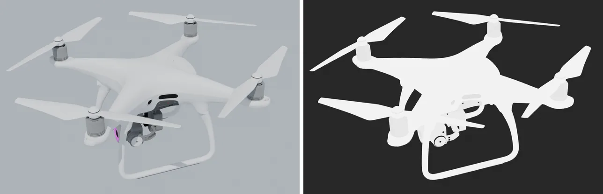
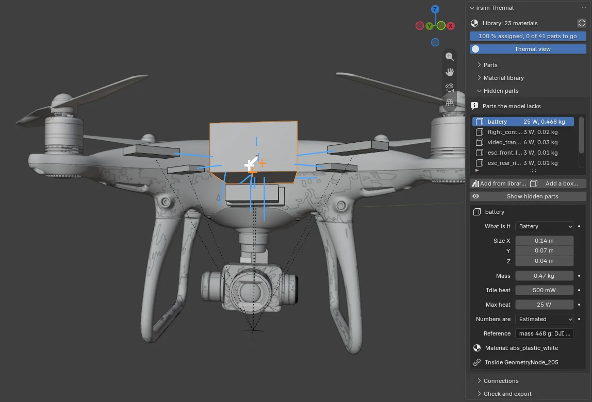

# The Blender add-on: irsim Thermal Materials

**irsim Thermal Materials** is a Blender add-on that prepares a 3D model for the infrared simulator.
You open a model, say what every part is really made of, add the parts the model does not have,
check it, and export it. What comes out is a USD file and an asset config that irsim renders
directly. You need no Python.

## Why a thermal simulator needs it

A downloaded model is grouped by how it *looks*: "white plastic" on the shell and the propellers,
"metal" on the motors. A thermal camera does not see looks. It sees temperature, and how much each
surface *emits*. A matte plastic emits almost like a black body and shows its own temperature;
polished aluminium hardly emits, so it mostly shows a reflection of the sky. When the Phantom 4's
motor housings were once guessed to be polished aluminium, a hot motor rendered as cold sky. So
every part needs its real material, and a person looking at the part is the best judge of what that
is. The add-on is where that person works.

## What it does

| | |
|---|---|
| **Assign materials** | Pick a part (or some faces) and choose from the [material library](materials.md): 49 materials, each with its emissivity in the four camera bands. A shared Blender material is copied, never changed behind your back. |
| **See the result** | A thermal view shades every part by its long-wave emissivity, so a mirror-like part stands out at once. |
| **Start from an existing map** | A model the project already knows opens with its material map applied. |
| **Add a material** | Type a new material's numbers; irsim checks them with its own rules (for example that emissivity, reflectance and transmittance add up to one) before anything is written. |
| **Find connections** | The add-on finds which parts touch and which face each other across a gap, because that is how heat moves between them. You review each one. |
| **Add hidden parts** | A battery inside a drone, an engine inside a car shell: 97 placeholder components at real size, from drone parts to ship engines. They go into the USD as real objects that the cameras never render. |
| **Check and export** | A checklist names every unassigned face, mirror-like part and missing number. The export writes the USD, the asset config and the parts' connections, and refuses to overwrite a file it did not write. |

## How it fits with irsim

The add-on has no physics of its own. Blender's Python cannot load irsim, so the add-on asks the
project's own Python (a small "bridge" program) for the material library and for every check. The
numbers you see in Blender are therefore exactly the numbers the simulator uses, and a rule the
simulator enforces is enforced in Blender too. When the library grows, Blender shows the new
materials on its next refresh.

The export writes three things:

- `3d_models/<name>/<name>.usdc`, the model, with hidden parts marked so cameras skip them
  (checked in Isaac Sim 6.0: a hidden part appears in neither the colour image nor the depth);
- `configs/assets/<name>.yaml`, which part is made of which library material;
- `3d_models/<name>/<name>.structure.yaml`, the connections and hidden parts with their mass and
  heat.

## Start here

- **[The tutorial](tutorials/blender-addon/README.md)**: install, assign, connect, hide, check and
  export, one page per step, ending with the DJI Phantom 4 done from start to finish.
- **[The material library](materials.md)**: what each material is, where its numbers came from,
  and how you can check them yourself.
- **[The component library](../blender_addon/irsim_thermal/components/README.md)**: the 97
  hidden-part placeholders and their sizes.
- **[The add-on's plan](../blender_addon/PLAN.md)**: the decisions behind it, what is not built
  yet, and the log.

## Status

Version 0.3.0, for Blender 5.2. Tested by 72 tests of its Blender-free logic and bridge, and 142
checks in a headless Blender against a scratch copy of the repository; the full Phantom 4 (2.5
million faces) is exported and passes the project's asset audit. It lives in this repository under
`blender_addon/` for now and may move to its own repository later.

Known limits, stated in the plan: the hidden-part placeholders are boxes, cylinders and cones until
someone models the real thing; their mass and heat are the user's to fill in; and connections and
hidden parts go to the side file above, while the asset config has since gained its own place for
them (roadmap `AI.11`), so writing them there directly is the next step.
