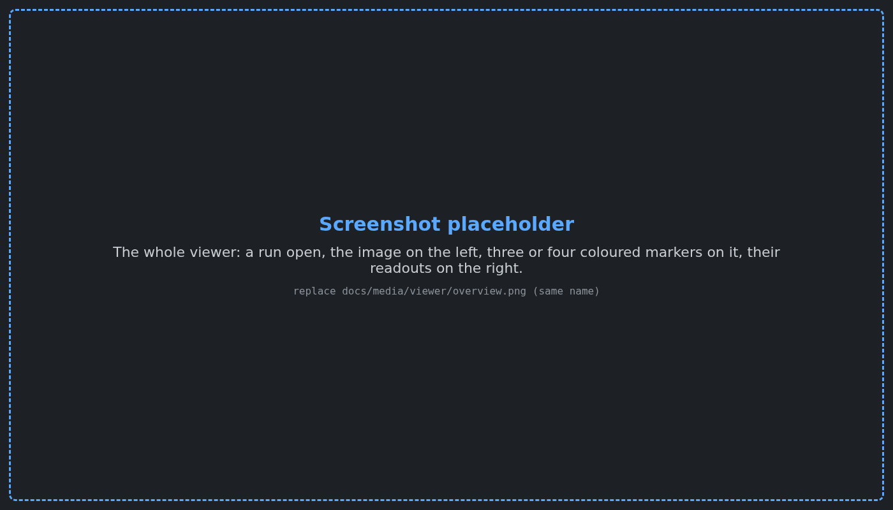
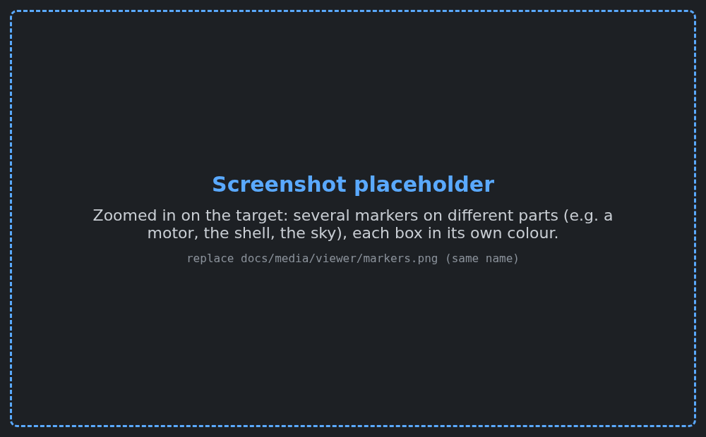
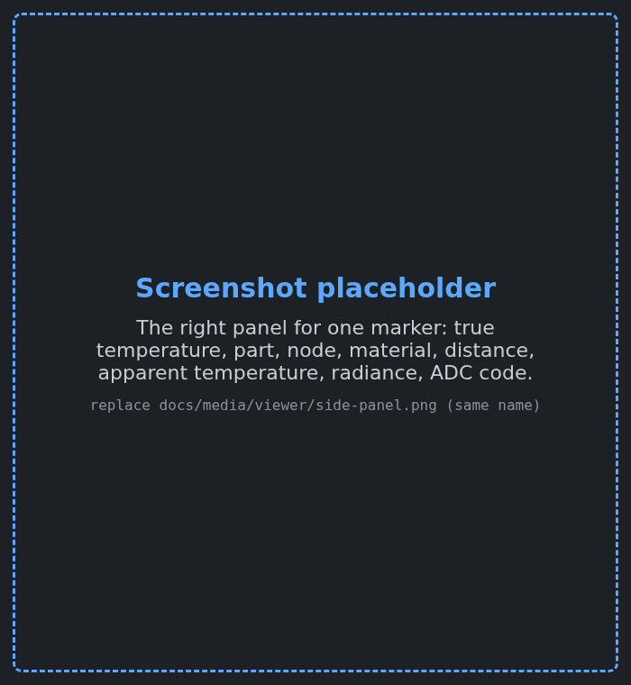
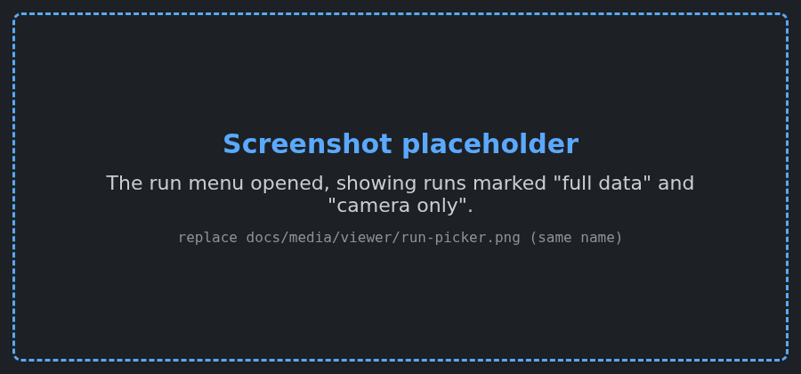
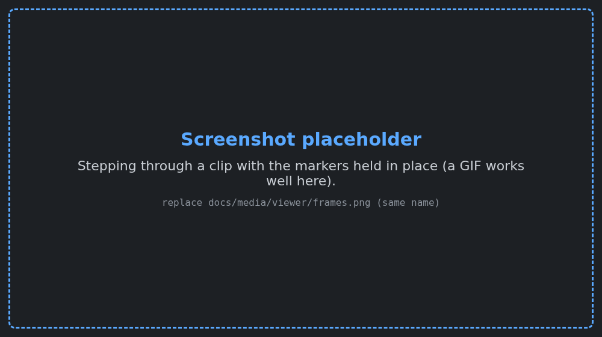

# Frame viewer

Open a rendered frame, click on it, and see what is really at that pixel: the true surface
temperature, which part it is, how far away it is, and what the camera measured there. Use it to
debug a render. When a motor looks too cold or the sky too bright, click it and compare the
numbers.



## Start it

From the repository folder:

```bash
make viewer
```

Your browser opens on the viewer. That is all. It finds the right Python by itself and needs
nothing installed beyond what the project already uses. Stop it with **Ctrl+C** in the terminal.

To open one render, or a different folder of renders:

```bash
make viewer RUN=outputs/phantom4_perpart_truth
```

If the browser does not open, go to the address the terminal prints, normally
`http://127.0.0.1:8765/`.

## Use it

1. **Pick a run** from the menu at the top left. The newest run is listed first.
2. **Click the image.** A coloured marker appears with a small box beside it. The panel on the
   right lists everything saved for that pixel.
3. **Click again** for another marker, in another colour. Add as many as you need to compare
   points, for example a motor, the shell and the sky behind them.
4. **Remove a marker** with its **×** in the right panel, or remove them all with
   **clear all**.
5. **Move through a clip** with **◀ ▶**, the slider or the arrow keys, or press **play**. The
   markers stay where you put them and their numbers update for each frame.



| Do this | To |
|---|---|
| click | add a marker |
| drag | move the image |
| mouse wheel | zoom in and out |
| **f** | fit the image to the window again |
| **←** / **→** | previous / next frame |
| space | play / pause |
| **h** or **? help** | show the instructions in the right panel |

The **image** menu changes what you look at: the camera's display image, the visible-light
companion, or any saved data plane drawn in gray. A click always reads every plane, whichever one
is on screen.

To share a view, copy the address bar. The link reopens the same run and frame with the same
markers.

## What the numbers mean



| Row | What it is |
|---|---|
| `temperature_k` | The **true** surface temperature at the pixel's centre, as the thermal model computed it. For the sky, the sky's apparent temperature. |
| `apparent_t` | The temperature the **camera** reports. It differs from the true value because of emissivity, reflected sky, the atmosphere and lens blur. That difference is often exactly what you are debugging. |
| `part_id` | Which part of the model the pixel belongs to, for example `motor_rear_left`. `(sky / no geometry)` means the ray hit nothing. |
| `node_id` | Which thermal node heats that part. The row below it gives that node's temperature from the frame's metadata. |
| `material_id` | The material, for example `aircraft_aluminium_painted`. |
| `distance_m` | Distance from the camera, in metres. Empty (`nan`) for the sky. |
| `radiance` | The in-band radiance reaching the camera. |
| `dn16` | The raw number the camera's ADC produced. |
| `display8`, `rgb` | The pixel's colour in the display image and in the visible-light companion. |

The panel shows temperatures in both kelvin and °C. The **frame metadata** section at the bottom
lists the frame's own facts: time, range, and every node's temperature.

**At edges, true and apparent temperature disagree on purpose.** A pixel on an object's outline
sees part object and part sky. The camera value mixes them, while the true value describes only
the point at the pixel's centre.

## Runs marked "camera only"



The run menu marks each run **full data** or **camera only**. A camera-only run was rendered
before frames saved the scene truth. It still opens and a click shows what the camera measured,
but not the true temperature, part or distance. Render it again with any of the render scripts to
get full data (ADR 0154).

## Clips



A clip shows only the frames whose data was saved. If a render thinned its saved frames with
`--plane-stride 8`, the viewer shows every 8th frame and says *every 8th* next to the frame name.

## When something is off

| You see | Why | What to do |
|---|---|---|
| A yellow warning on a marker | One saved plane has a different size from the image, so the pixel had to be estimated. | Treat that row with care. The other rows are exact. |
| "Camera data only" banner | The run predates the truth planes. | Re-render it, or pick a run marked full data. |
| `viewer: no Python here can import irsim_viewer` | No interpreter with NumPy and PyYAML was found. | Run `make viewer PYTHON=/path/to/IsaacSim/.../python.sh`. |
| "Address already in use" | A viewer is already running. | Use the open tab, or start another with `scripts/viewer.sh outputs --port 8766`. |

## For developers

The viewer lives in `src/irsim_viewer/` and reads files only through one interface,
`FrameSource` in `src/irsim_viewer/source.py`. A new file type takes one registered reader. A
different data layout, such as a Warp buffer dump, takes one new source class. The page and the
server stay unchanged. The design and its trade-offs are in
[ADR 0154](decisions/0154-a-frame-viewer-reads-scene-truth-beside-the-camera.md).
