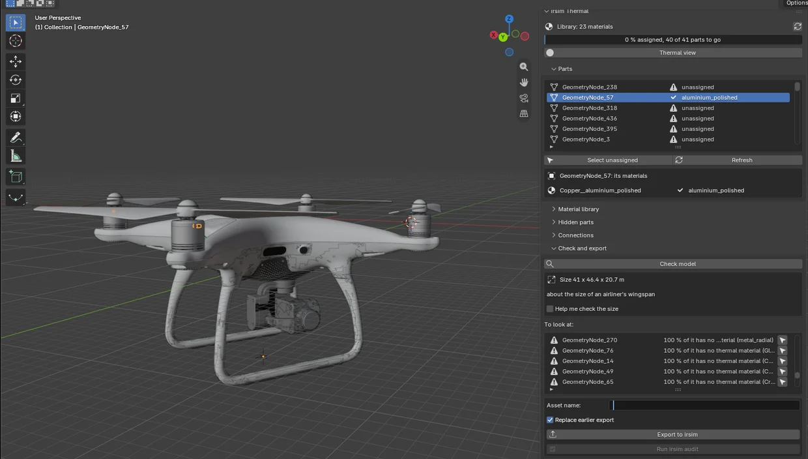

# Open the model and make its parts real parts

Import the model as usual: **File ▸ Import** (FBX, glTF/GLB, OBJ or USD). Press **N** in the 3D
viewport, pick the **irsim** tab and click **Load library**.

The tab has a bar showing how much of the model is done, the **Thermal view** switch, and five
sections:

- **Parts**: every mesh object in the scene, each with its thermal status.
- **Material library**: every material irsim knows, with its numbers.
- **Hidden parts**: the parts the model lacks, such as an engine or a battery.
- **Connections**: which parts touch, and which face each other across a gap.
- **Check and export**: what is left to do, and the button that hands the model to irsim.

## Parts are objects

irsim treats every **object** as a part, and the part's name is how a scene refers to it later
(`prim: battery`). Downloaded models are often grouped by look rather than by function: one object
holds all the white plastic, and another holds the four propellers together. Use Blender as you
normally would:

- **Separate** (`P` in Edit Mode) to split a propeller away from the arm.
- **Join** (`Ctrl J`) to merge pieces that are really one part.
- **Rename** (`F2`) to what the part really is: `battery`, `propeller_front_left`, `motor_rear`.

The model in the picture shows why renaming matters: the Sketchfab conversion called every one of
its 41 parts `GeometryNode_<number>`. The checklist flags names like that, and Blender's own
`Cube.003`.

You can do this before or after assigning materials. **Assignments follow the faces**, so joining,
separating, extruding or duplicating keeps every face's material.
