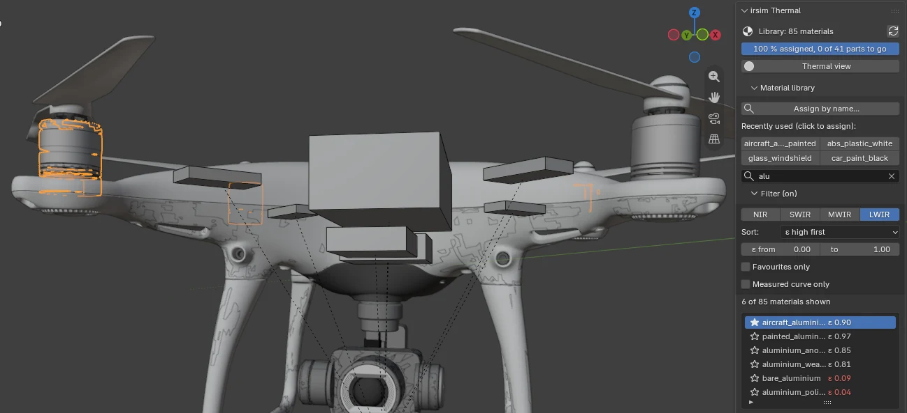

# Assign materials

1. Click a part in the **Parts** list, or in the viewport. The box under the list shows its Blender
   materials and whether each one has an infrared material yet.
2. In the **Material library**, click the material the part is really made of. The box below it
   shows:
   - **ε / ρ / τ per band**: how much the surface **emits**, **reflects** and **transmits** in
     NIR, SWIR, MWIR and LWIR. The three always add up to 1.
   - **Solar absorptivity**: how strongly sunlight heats it.
   - **Heat capacity**: how slowly it warms up and cools down.
   - A red warning if LWIR ε is below 0.2 (mirror-like).
3. Click one of:
   - **Assign to selected parts**: every face of the selected objects.
   - **Assign to every part using '<material>'**: every object that uses the active Blender
     material. Useful when a download's "white plastic" really is one material everywhere.
   - In **Edit Mode**, **Assign to selected faces**: for a part made of two things, such as a wheel
     with a rubber tyre and a metal rim.

## Find a material quickly

The library has close to a hundred materials, so the panel helps you find one:

- **Assign by name...** opens a search box: type a few letters (`polished al`, `paint black`,
  `carbon`) and press Enter, and the selected parts (or, in Edit Mode, the selected faces) get that
  material at once. It is also on the **right-click menu** in the viewport, in Object Mode and in
  Edit Mode. Each line shows the material's emissivity, so you can tell `bare_aluminium` (ε 0.09)
  from a painted one before you pick.
- **Recently used**: the last four materials you assigned, as buttons. One click assigns again,
  which is most of the work on a model with many parts of the same plastic.
- **The search field** above the list narrows the list to the materials whose name, description or
  surface start with the words you type, in any order.
- **The star** at the start of each row makes a material a favourite. Favourites come first in the
  list and in the search box, and they are kept in Blender's preferences, so they are still there
  in the next file you open.
- **Filter and sort** (click to open): choose the band whose emissivity the list shows (NIR,
  SWIR, MWIR or LWIR), keep only materials in an emissivity range, sort by name or by emissivity,
  and show only favourites or only materials with a **measured curve**. Asking "what in the library
  is mirror-like in LWIR?" is the band LWIR and ε from 0 to 0.2.

**If two parts shared a Blender material** and you give one of them a different infrared material,
that part gets a copy of the material: same look, own infrared material, named
`white_plastic__carbon_fibre`. The other part is not changed. Parts you did not select are never
changed by an assignment.

## The thermal view

**Thermal view** (the switch at the top) colours each part so that its brightness on screen is its
LWIR emissivity: white emits, black is a mirror. Anything still unassigned shows in **magenta**. It
changes only the viewport colours; switch it off and the model looks as before. A part with no
material at all cannot be coloured and stays grey; the checklist lists it instead.

This view is how a wrong material shows up. On the Phantom 4, an old automatic rule once made the
motor housings polished aluminium (ε 0.09):

In the thermal view they turn black: a hot motor would have shown up as reflected sky. These
pictures show **emissivity, not temperature**: they are the add-on's view, not a thermal image.
