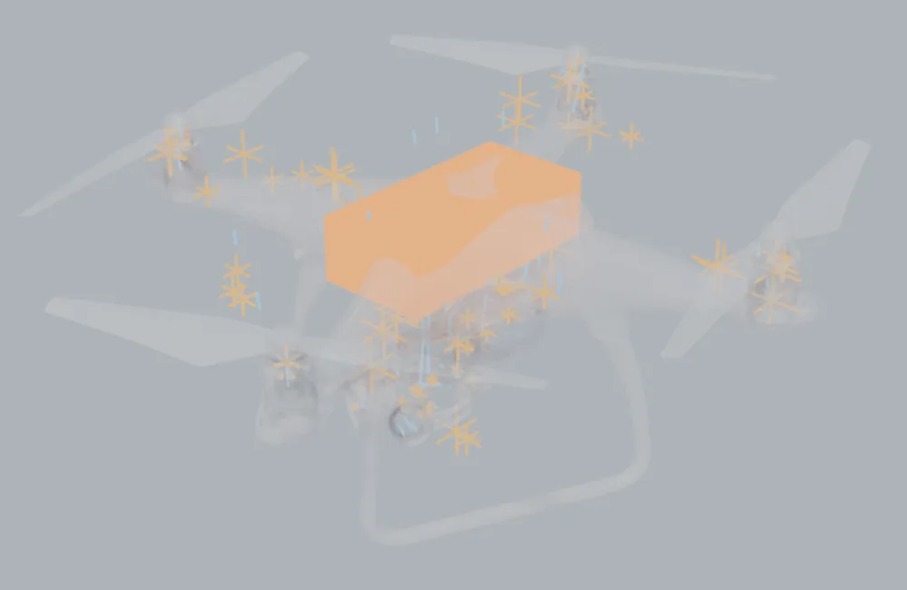
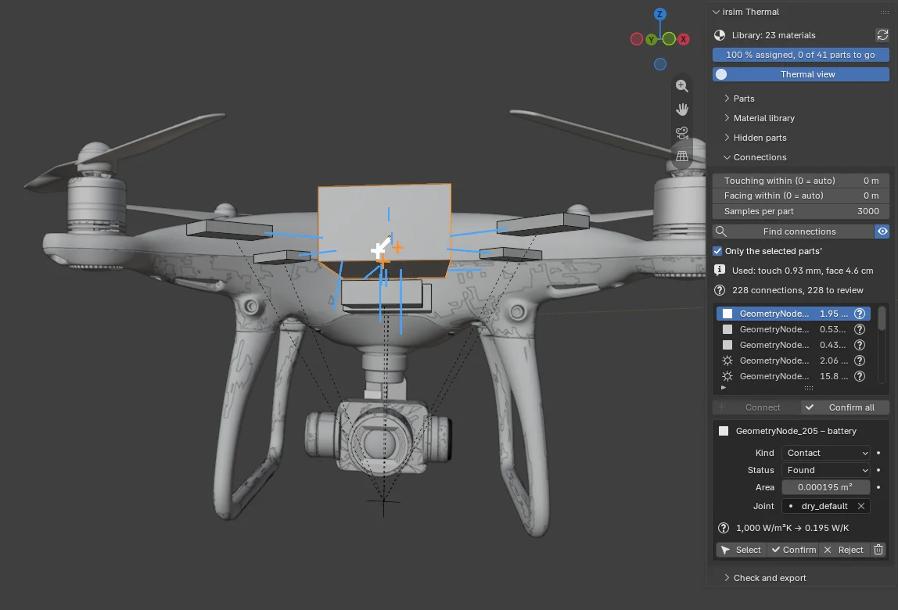

# Find the connections between parts

Heat moves between parts in two ways that matter here: **through a contact**, where two parts
touch (a motor bolted to an arm), and **across a gap by radiation**, where they only look at each
other (an engine and the bonnet above it). irsim's solver needs to know both, and a downloaded
model says neither. The **Connections** section finds them for you to review.

## Find

Open **Connections** and click **Find connections**. The three settings above the button are
usually right as they are:

- **Touching within**: surfaces closer than this count as touching. `0` (automatic) means 0.2 %
  of the model's size, at least half a millimetre. Downloaded parts are placed by eye, so a motor sitting
  "on" an arm is often a fraction of a millimetre off it, or into it.
- **Facing within**: parts that look straight at each other across less than this count as
  facing. `0` (automatic) means 10 % of the model's size. After a search, the line **Used:** says
  which distances it used.
- **Samples per part**: more is slower and more exact. The default, 3000, measures a contact to a
  few per cent.

On the Phantom 4, with a battery added inside it ([step 7](07-hidden-parts.md)), the search takes
about 10 seconds over 2.5 million faces. It finds 102 contacts and 87 facing pairs.

Tick the eye button beside **Find connections** to see them in the viewport, as in the picture:
each contact is a small **orange cross** where the two parts touch, and each facing pair is a
**blue line** across the gap. The connection selected in the list is drawn **white**, with lines
to the middle of its two parts, so you can see which two they are.

A real model has hundreds, so with **Only the selected parts'** ticked (the default) the list and
the viewport show just the connections of what you have selected, each row named by the *other*
part. Below, the battery is selected: its contact with the shell is picked in the list, and its
facing pairs are the blue lines.

## Review

Everything the finder proposes starts as **found** (a question mark in the list). For each one:

- **Select** selects its two parts in the viewport.
- **Confirm** keeps it. **Reject** rules it out: it is not exported, and a new search will not
  propose it again.
- For a contact, choose the **Joint**: how the two parts are held together. The joints come from
  the project's measured table (`configs/thermal/joints.yaml`); a new bolted steel joint conducts
  about twelve times better than the dry default. The line under it gives the joint's value and
  what it comes to over this contact's area, in W/K, with a tick for a measured value and a
  question mark for an estimate.
- The **Area** can be typed over if you know better.
- **Confirm all found** accepts everything you have not reviewed.

**Connect** adds a connection the finder missed: select the two parts and click it. A
contact added this way is measured if the parts touch; if they do not, type its area.

Running **Find connections** again after you edit the model updates what it found, but never
changes your decisions: a confirmed connection stays confirmed with the joint you chose, and a
rejected one stays out.

## What it is, and what it is not

A contact's area is measured by scattering points over each part and counting the ones that lie
against the other part, straight across and roughly parallel. A facing pair's area is the part of
one surface whose outward direction reaches the other part first. That tells you **which** parts
exchange heat by radiation; how much is a *view factor*, which the physics project will compute
itself (roadmap row TC.9). The **contacts** are what irsim's thermal solve uses: the export writes
them into the asset config, each with its joint and area ([step 9](09-export.md)). The facing pairs
stay in the add-on's own record beside the model, because irsim traces radiation between parts
itself.
