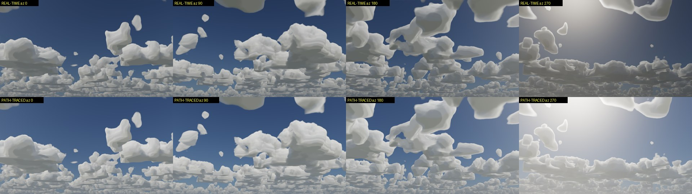
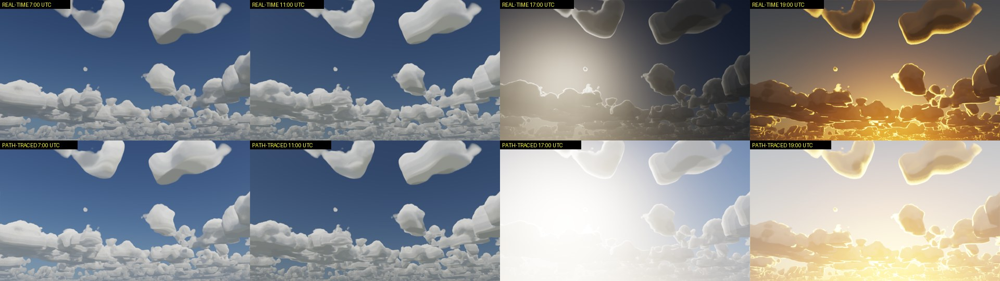

# Weather and clouds: what exists, why the clouds look wrong, and what it takes to fix them

**Status, 2026-10-03.** The owner looked at the newest cloud renderer (the per-pixel march of
ADR 0186) in the Isaac Sim viewport and rejected how it looks. Camera rotation and the change of
the hour are accepted; the cloud itself is not. This document is the full picture a person needs
before touching the clouds again: what the weather system must do, what is built, exactly what is
wrong in the picture and where each fault comes from, why the problem is hard, and what any fix
must keep so the same cloud can later be shown in the infrared.

**Update, 2026-10-04: the cumulus is now built from simulated cloud patches.** The faults of §5
were worked through in `isaac-weather-fx` on 3 and 4 October, with a sheet rendered by Isaac Sim
in both render modes after every change (`outputs/cloud_look/`):

| Change | What it fixed | What it did not |
|---|---|---|
| Density graded, crisp top, soft base (`9fd49dd`) | F2, F3: no clipped solid | the shape |
| Scattering octaves, jittered light samples (`b7b32cc`) | F4, part of F5: no contour bands | the shape |
| Jitter per frame, accumulated over frames (`7186afd`) | grain | the shape |
| One auto exposure for both modes (`af589d8`) | F8 | the shape |
| **Simulated patches replace the noise function for cumulus (`b4de1e2`)** | **F1, F6: the shape** | see below |
| Open-wall simulations, boxes fit their cells, less deep-scatter light (`77e71ea`) | flat cut faces; evenly white clouds | flat bases |
| Patches cut at their widest level (`2cf3a6d`) | round bottoms: a flat base | uniform skin |
| Erosion varies across a cloud (`20f975d`) | the cotton look | one size class |
| A fine lattice of small clouds (`f50c574`) | every cloud one size | frame time (+40 %, to be re-measured) |
| **The veil: cloud in front of scene surfaces (`f2afa0d`)** | **F9: the cloud was a backdrop** | one camera; grain in the path tracer when a veil is drawn |

The owner rejected the first four together ("the shape not changed at all ... some cloud seen
in mobile games"): a 2D map pushed up into 3D and rounded by a few noise lobes stays a rounded
block whatever its skin and its light. What changed the picture was the shape's source. A fluid
solver (Blender's gas solver, run headless by `tools/simulate_cloud_patches.py`) grows patches of
cumulus from warm bubbles, with wind shear and evaporating edges; a patch is a density grid of
10 m cells, 1-2 MB. The cloudscape places one per cell of a lattice the weather map keeps, on one
base, and the per-pixel march of ADR 0186 draws them. Blender makes the shape once, offline;
Isaac Sim renders every frame, in RTX Real-Time and the path tracer alike (38 fps at 1280 x 720
on the A6000). It is still a density in metres with a numpy reference, so §7's contract holds.

The veil works like this: each frame the march reads the scene's depth on the GPU (replicator's
`distance_to_camera`, 0.4 ms) and keeps the cloud in front of every surface apart; a second quad
half a metre in front of the camera emits that cloud at that cloud's opacity, and the renderer
blends it over the scene, the same in both modes. A ball 10 km away behind a cumulus is hidden
by it; one 1.5 km away under the base is not (`outputs/cloud_look/s5_final/`).

The owner accepted this cumulus ("much much better") and set what comes before the infrared
conversion: the new controls in the UI (spacing, size mix, erosion), congestus at this quality
with mixed skies (towers in front of towers), and a storm sky that covers everything. Still open
besides: the solver is a smoke solver, so a patch has no water content or temperature of its own
(they come from height above the base); the patches are frozen snapshots; cover saturates near
0.4-0.5; frame time was measured on a shared GPU only (19-30 fps at 1280 x 720). The infrared
reads the cloudscape through the deck (`WX.26`, ADR 0190), every genus including a cirrus, and
the two bands' agreement is measured per frame rather than judged (ADR 0191). §4's table, §5 and §8-§9 below
describe the state before this work and are kept as the record of why.

The order of work the owner set: **the visible (RGB) picture first, inside Isaac Sim, good in
both RTX Real-Time and the path tracer; the infrared conversion later**, but nothing done for RGB
may make that conversion impossible.

Contents

1. [What weather management must do](#1-what-weather-management-must-do)
2. [The system on one page](#2-the-system-on-one-page)
3. [What a real cumulus looks like](#3-what-a-real-cumulus-looks-like)
4. [The four cloud renderers that exist](#4-the-four-cloud-renderers-that-exist)
5. [What is wrong in the picture, fault by fault](#5-what-is-wrong-in-the-picture-fault-by-fault)
6. [Why this is hard](#6-why-this-is-hard)
7. [The infrared contract: what RGB work must not break](#7-the-infrared-contract-what-rgb-work-must-not-break)
8. [Ways forward](#8-ways-forward)
9. [Proposed order of work](#9-proposed-order-of-work)
10. [Questions for the owner](#10-questions-for-the-owner)
11. [Fog, rain and snow in brief](#11-fog-rain-and-snow-in-brief)
12. [Sources](#12-sources)

---

## 1. What weather management must do

These are requirements, most of them stated by the owner. Every design choice below is judged
against this list.

| # | Requirement | Where it comes from |
|---|---|---|
| R1 | One description of the weather drives everything: sky, sun, clouds, fog, rain, snow, the thermal solver and the infrared atmosphere. No scene may run two weathers. | `CLAUDE.md` non-negotiable 6 |
| R2 | Everything is rendered inside Isaac Sim. No outside tool makes the picture. | owner, 2026-10-03 |
| R3 | RTX Real-Time and the path tracer must both look good, and must show the same clouds. | owner, 2026-10-03 |
| R4 | The cloud must look right from every camera heading. | owner, 2026-10-03 |
| R5 | The cloud must be convertible to the infrared. A photograph, an HDRI or any painted sky is ruled out, because a picture has no density, no temperature and no distance. | owner, 2026-10-03 |
| R6 | A cloud between the camera and a target hides the target, in every band, by the physics along the ray. | owner, earlier; ADR 0073 |
| R7 | The visible frame is the reference a person checks the infrared frame against, so the two must place the same cloud in the same pixels. | owner, earlier |
| R8 | Demo scenes must look real. A sky that looks synthetic fails the demo even when its numbers close. | owner, earlier |

R5 and R8 pull against each other. Nearly every good-looking sky available online is a picture
(fails R5). Nearly every physically defined cloud field looks plain unless a great deal of work
goes into its shape and its lighting (fails R8). That tension is the whole problem.

## 2. The system on one page

The weather code is a separate project, `isaac-weather-fx`, used here as the submodule
`third_party/isaac-weather-fx`. This repository adds the infrared side.

```
                     WeatherState  (one object: site, date, hour, clouds, fog, wind, rain, snow)
                          |
      +-------------------+--------------------+---------------------------+
      |                   |                    |                           |
  sun, moon, sky      clouds               fog, rain, snow            irsim (this repo)
  celestial.py        clouds.py            fog.py                     atmosphere/weather_fx.py
  sky.py              cloudscape.py        precipitation.py           thermal/weather_fx_series.py
  (dome light,        gpu/cloud_march.py   (RTX fog settings,         (the same state feeds the
   sun light)         clouds_pixel.py       particle instancer)        thermal solver and the
                      clouds_volume.py                                 infrared march)
```

| Part | What it does today | State |
|---|---|---|
| Sun and moon | Real positions from place, date and hour (NOAA and Meeus) | Works, tested |
| Clear sky | Physical sky baked to a dome light; lights the scene | Works; accepted by the owner ("the day time change is surprisingly nice") |
| Clouds | Four renderers, see §4 | **Look rejected** |
| Fog | RTX fog set from a visibility in metres | Works in RGB; infrared version is roadmap `WX.11`–`WX.14` |
| Rain and snow | Particles that follow the camera | Works in RGB, looks like white lines; roadmap `WX.15`–`WX.17` |
| Wind | Drifts the clouds and the particles | Works |
| Infrared | Marches the cloud's density along each ray, emission by temperature (`docs/physics-model.md` §7.5, §7.6) | Works for the *old* cloud field only |

`core/` in the weather project is pure Python and NumPy with no engine import, like `src/irsim/`.
That is what lets the infrared side read the same cloud without Isaac Sim.

## 3. What a real cumulus looks like

A list of what the eye checks, so that "looks bad" can be turned into things to fix. Each item is
something a person sees in any photograph of fair-weather cumulus.

1. **Hard tops, soft bottoms.** The rising top of a cumulus has a crisp, cauliflower outline. The
   base is flat and a little ragged. A cloud that is equally soft everywhere looks like cotton or
   smoke.
2. **Detail at every size.** Lobes sit on lobes on lobes, from a kilometre down to a few metres,
   because the air inside is turbulent. A camera with a 60° lens and 1280 pixels resolves about
   2.5 m at 3 km. Where the detail stops, the cloud turns to plastic.
3. **A flat base on one level.** Every cloud in the field starts at the same height (the
   condensation level).
4. **Bright white tops, grey bases.** The sunlit side is close to white and several times
   brighter than the blue sky. The base is grey, darker for a deeper cloud. Inside the bright side
   each lobe shades the crevice beside it, which is what makes the cauliflower readable.
5. **Bright edges toward the sun** (the silver lining), but a cloud in front of the sun still has
   a visibly lit, grey body. It is not a black shape with a glowing outline.
6. **Distance changes it.** Far clouds are bluer, paler and lower in contrast, and they bunch
   toward the horizon into a band with flat bases seen edge-on.
7. **No pattern.** No two clouds are alike and nothing repeats.
8. **It moves and it changes.** Clouds drift with the wind and their edges evolve over minutes.

## 4. The four cloud renderers that exist

Four ways of drawing a cloud have been built since September. They do not share one cloud.

| Renderer | The cloud is | Drawn by | Real-Time | Path tracer | Infrared reads it | Main fault |
|---|---|---|---|---|---|---|
| **Dome** (`core/clouds.py`, `sky.py`) | `CloudField`, a 60 m voxel grid | marched once into the sky dome's picture | yes | (not used) | yes | The dome picture is about ten times coarser than the camera's pixel, so the cloud is blurred, and how blurred depends on where the camera looks. This was the "awful after rotating 90°" fault. |
| **Volume** (`clouds_volume.py`) | the same grid as OpenVDB tiles | RTX's own volume rendering | no (Real-Time cannot draw volumes) | yes | yes | Voxel blocks ("popcorn"), green bases from the ground's bounce, no air in front of far clouds, and a different picture from Real-Time. |
| **Hero** (`clouds_hero.py`) | one sculpted cloud (the Disney cloud) copied around | RTX's volume rendering | no | yes | only through a side door | One asset repeated; path tracer only. |
| **Pixel** (`cloudscape.py`, `gpu/cloud_march.py`, `clouds_pixel.py`) | `Cloudscape`, a function built from three small noise textures | our own GPU march per camera pixel, shown on a quad that rides with the camera | yes, 44–48 fps | yes, same picture | **not yet** (`WX.26`) | The subject of §5. |

The pixel renderer solved the *structural* faults: it is sharp at the screen's own resolution in
every direction, it is the same in both render modes, and it runs in real time inside Isaac Sim
(ADR 0185, ADR 0186). What it did not solve is the cloud itself. The renderer is now good enough
to show clearly that the cloud it is given is poor.

## 5. What is wrong in the picture, fault by fault

All frames below were rendered by Isaac Sim on 2026-10-03 with `clouds.render_path = "pixel"`,
cumulus, cover 0.35. Top row RTX Real-Time, bottom row path tracer.





Each fault below names what is seen, the cause in the code, and how sure the cause is.
"Measured" means read from the code or the frame; "likely" means it follows from the code but has
not been isolated by an experiment yet.

### F1. The clouds look like melted wax: no fine detail

*Seen:* smooth, rounded blobs. No cauliflower. This is the largest single fault.

*Cause (measured):* the function has nothing small in it. The shape noise is a 128³ texture
stretched over 4200 m, so one texel is 33 m, and its lobes are 700, 350 and 175 m across. The
detail noise is 64³ over 520 m (8 m texels) with cells of 130, 65 and 32 m, the last carrying one
eighth of the weight. So the smallest structure with any strength is about 65 m. The camera
resolves 2.5 m at 3 km (§3 item 2). The cloud is twenty times smoother than the screen can show.
The detail noise is also used only to *erode the edge*, with strength 0.5; it adds nothing to the
lit face of the cloud.

### F2. Edges are out of focus, most of all on near clouds

*Seen:* the clouds overhead (headings 180 and 270) have a wide soft halo, like a blurred photo.

*Cause (measured):* density climbs from zero to full over tens of metres, because it follows the
33 m shape texture, and the extinction is 0.06 per metre, so light needs about 17 m of full cloud
to be stopped. Together the edge is roughly 50 m wide. At 2 km that is 1.4°, about 30 pixels of
blur at 1280 across. Real rising cumulus tops are sharp to a few metres.

### F3. The top of the cloud fades instead of ending

*Seen:* no crisp upper outline; the clouds thin out upward.

*Cause (measured):* the height profile in `Cloudscape._density` is
`smoothstep(0, 0.07) · (1 − smoothstep(0.35, 1.0))`: full strength from 7 % to 35 % of the
cloud's height and then a long fade to the top. This is the reverse of a real cumulus, where
liquid water *increases* with height above the base (adiabatic lifting) and the top is the
densest, sharpest part. Nubis uses the profile to shape the cloud and a separate density that
grows with height; here one curve does both and gets the density backwards.

### F4. Contour lines on the cloud faces, like a terraced hill

*Seen:* stepped bands of grey across the lit faces, clearest at heading 0 and 180.

*Cause (likely, two candidates):* (a) the light reaching each point is found with eight fixed
steps toward the sun (8 m, 16 m, 32 m, … with no jitter; only the camera ray is jittered), so the shading changes in steps;
(b) the textures are read with linear interpolation, whose slope jumps at every texel boundary,
and on a 33 m texel those creases are many pixels apart. *To isolate:* jitter the sun steps and
see whether the bands turn to fine grain; read the shape with a smooth (cubic) filter and see
whether the creases go.

### F5. Flat, grey lighting

*Seen:* clouds are mid-grey, never white. In the Real-Time frame at heading 90 the brightest
cloud pixels are 187 of 255 and the median cloud pixel is 109; the sky is (42, 63, 99). There is
little difference between the lit side and the shaded side of one cloud, and no dark crevices.

*Cause (partly measured, partly likely):* three things add up.
(a) With no small lobes (F1) there is nothing to cast small shadows, so the face cannot have
texture however good the lighting is.
(b) The multiple-scattering term is a smooth function of the optical depth toward the sun along
one chord. It gets the total energy about right and removes local contrast.
(c) Exposure: the layer takes the dome's exposure, which was set for the dome. The clouds are
not pushed to white, and the sky comes out a dark saturated blue. Which of these matters most is
not yet measured.

### F6. The horizon is a stack of plates

*Seen:* far clouds form thin flat slabs in rows, and the rows look alike.

*Cause (measured):* (a) the march's step grows with distance, `max(24 m, 1.2 % of the range)`,
and takes 0.3 of that inside cloud, so at 20 km a step is 72 m and a 400 m cloud gets five
samples. (b) The shape texture repeats every 4200 m, so a 20 km view shows the same lobes five
times in a row. (c) The weather map's smallest feature is 500 m; small far clouds are single
features with no outline of their own. (d) Seen edge-on, the fading top of F3 makes each cloud a
lens, not a heap.

### F7. Toward the sun: neon outlines, dark bodies

*Seen:* at 17:00 and 19:00 each cloud is a dark shape with a glowing rim.

*Cause (likely):* the single-scatter term has a strong forward peak (g = 0.85) and lights thin
edges fiercely, which is correct, but the body gets only the mean sky light, which is small when
the sun is low. In a real cloud, light entering the far side spreads through the body and the
near side glows softly. The two-stream term here models that only along the sun's chord.

### F8. The two render modes expose differently when the sun is in frame

*Seen:* at 17:00 and 19:00 Real-Time is dark and the path tracer is washed out. The clouds are
the same; the tone mapping is not.

*Cause (measured):* Real-Time runs auto-exposure on the histogram, the path tracer does not, and
the layer's brightness is fixed to the dome's exposure. This is a renderer-settings problem, not
a cloud problem.

### F9. Things the pixel renderer does not do at all yet

* **The clouds do not light the scene.** The dome stays clear, so there are no cloud shadows on
  the ground, no clouds in reflections, and no change of ambient light under an overcast. Only
  the sun dims when a cloud crosses it (`WX.10`).
* **One camera.** The quad belongs to the active viewport camera. A second camera sees it from
  the side.
* **No cirrus**, and no two layers at once. Only cumulus has been looked at; congestus,
  stratocumulus and stratus have profiles nobody has judged.
* **The cloud drifts but does not evolve.**
* **The infrared does not read it** (`WX.26`), which is why it is not the default.

## 6. Why this is hard

**D1. Isaac Sim's real-time renderer cannot draw a cloud.** RTX Real-Time has no volume
rendering and no hook for a custom sky shader. Unreal's volumetric cloud is a renderer feature;
Isaac Sim has no equivalent, so the idea can be used but not the implementation. Everything in
the pixel renderer (the march, the lighting, the air in front, the composite) is our own code,
handed to RTX as a texture on a quad. Every feature a game engine gives for free (cloud shadows,
reflections, several cameras, exposure) has to be built again around that quad.

**D2. A convertible cloud cannot be a picture.** R5 rules out the skies that look best with no
work. The cloud must be a density in space. Then its beauty has to come out of geometry and light
transport, which is exactly the expensive route.

**D3. The range of sizes is enormous.** The field must hold 30 km of sky and show 2 m lobes: a
ratio of 15 000. A grid that fine would be 10¹² cells. Games solve it with small repeating
noise textures added together, which is cheap and is what `Cloudscape` does, and the cost is
that the result is only as good as the noise recipe. Hand-tuning that recipe is craft, not
physics: Nubis was developed over several years (talks in 2015, 2017, 2022 and 2023), and the
last of them replaced noise functions with voxel clouds because the function does not hold up
when the camera is close to or inside a cloud.

**D4. Clouds are lit by light that has bounced hundreds of times.** A droplet absorbs almost
nothing in the visible, so the white of a cloud is all multiple scattering. Computing it honestly
takes a path tracer minutes per frame. Real-time methods fake it with a few terms (attenuation
octaves, a "powder" darkening, an ambient fill), each tuned by eye. Ours uses a two-stream
solution that conserves energy and is too smooth (F5, F7).

**D5. Real-time and path-traced must agree.** The path tracer can render a true volume and would
give better light, but then the two modes show different clouds, which the owner rejected in the
old renderers. Using our own march for both keeps them equal and means the path tracer's quality
is not used for the cloud.

**D6. The cloud has to be part of the scene, not a backdrop.** A target can fly in front of,
inside or behind a cloud (R6). So the march must stop at the scene's depth per pixel, and the
cloud must shadow the ground. A backdrop quad does the first only by sitting behind everything,
which is wrong the moment an aircraft enters a cloud.

**D7. Looks cannot be unit-tested.** The physics checks (energy, cover, sizes, fractal
dimension of the outline) all pass on the cloud the owner rejected. The tests that exist measure
what can be measured, and the eye measures something else. The only working test of the look is
the owner's judgment on a fixed set of views, beside reference photographs.

**D8. Too many renderers.** Four cloud paths and two cloud definitions exist (§4). Each new one
was added to fix the last one's fault. Until three of them are removed, every change has to be
made, or knowingly not made, in several places, and the infrared reads a cloud the viewport does
not show.

## 7. The infrared contract: what RGB work must not break

The conversion from a visible cloud to an infrared one is already specified
(`docs/physics-model.md` §7.5 and §7.6, and [the research note](../clouds-in-the-infrared.md)).
In short, along each camera ray the infrared march needs, at every point:

| The infrared needs | Where it comes from | What it means for RGB work |
|---|---|---|
| Visible extinction σ_vis in 1/m | `density(x, y, z) × extinction_per_m` | The density must stay in physical units. A cloud made to look denser must *be* denser. |
| The band's absorption | σ_vis × a per-band ratio (0.5 in LWIR for water cloud) | Data, already in place. |
| Temperature at the point | height above the base on the moist adiabat | The base height and the cloud's depth must be real heights in metres. |
| The same position in the world | the field's frame and its wind drift | One function, one frame, one drift for both bands. |
| The range to the target | the G-buffer depth | The march must be able to stop at any distance (D6). |
| Repeatability | seed and time | The function must be deterministic. No random detail that differs per frame or per render mode. |

This splits every possible improvement into two kinds.

**Shape work carries over to the infrared for free.** Anything that changes `density(x, y, z)`
(finer lobes, sharp tops, the right height profile, better far clouds, hero volumes) is seen by
the infrared march the day it reads the function. In the long-wave band a cloud is nearly a
black body within a few tens of metres, so its infrared picture is almost entirely *its outline,
its thin edges and its temperature by height*. Shape is what the infrared needs most, and shape
is also the largest fault in RGB (F1–F3, F6). The two goals point the same way.

**Lighting work is RGB only, and is free of the contract.** How sunlight is scattered, the
powder term, exposure and tone are not read by the thermal bands. They can be tuned by eye
without harming the conversion. (NIR and SWIR are sunlit and will want the same lighting with
their own constants; that is a later, smaller step.)

**What would break the conversion**, and so is not allowed:

* detail painted in screen space that is not in the density: sharpening, a noise overlay on the
  image, a normal-map trick;
* a density multiplier used for the look only (`clouds.density_scale` exists and must end up
  applied in both bands or removed);
* a different cloud per render mode or per camera;
* any sky or cloud that is an image.

Things that are fine: jittered sampling, temporal accumulation and any other *display* method
that converges to the same function.

## 8. Ways forward

**A. Repair the function.** Keep `Cloudscape` and fix what §5 measured: the height profile, a
steeper edge, two or three more octaves of detail that carve the lit face and not only the edge,
smooth filtering, jittered light steps, better steps at range, breaking the 4.2 km repeat, and
the exposure. Cheap, keeps real time, every change is also an infrared gain. Its ceiling is the
look of a good game sky seen from the ground. It will not hold up when the camera flies next to a
cloud.

**B. Real cloud volumes inside the same march.** Warp can sample NanoVDB volumes on the GPU
(`wp.Volume`), so the pixel renderer could march sculpted or simulated clouds (the Disney cloud
already in the project, or large-eddy simulation output) in real time, in both render modes, with
the same lighting code. They are densities, so they convert to the infrared like the function
does. This is the route to a cloud that survives a close look, and it is how Nubis moved on in
2023 (voxel clouds for flying through). Costs: memory, few distinct assets, licences (the Disney
cloud is CC BY-SA 3.0), and it is unproven here; the first step would be a timing experiment.

**C. Both.** The function for the field out to the horizon, volumes for the few clouds near the
camera or near a target. This is what the roadmap already intends (`WX.7`–`WX.9`: procedural,
volumes, mixed).

**Not an option:** an HDRI or photographic sky (R5); Unreal's renderer (the project is Isaac Sim only for
now, and D1); letting the path tracer draw a different, better cloud than Real-Time
(R3).

**Recommended:** A first, because F1–F6 are faults that would spoil B as well (lighting, exposure,
horizon, edges), and because each is small and can be judged alone. Then the timing experiment
for B, and decide C on its result.

## 9. Proposed order of work

Each step ends with the same six Isaac Sim views (four headings at midday, one toward a low sun,
one horizon close-up) in Real-Time and path-traced, on one sheet beside reference photographs,
plus the pan video. The owner accepts or rejects each step on that sheet.

| Step | Fixes | Kind |
|---|---|---|
| 1. Height profile: density grows with height, flat base, crisp top | F3, part of F6 | shape |
| 2. Edge steepness and extinction, so an edge is metres wide, not 50 m | F2 | shape |
| 3. More octaves, and detail that carves the whole lit surface | F1 | shape |
| 4. Isolate and remove the contour bands | F4 | sampling |
| 5. Lighting: per-lobe shadowing contrast, white tops, soft glow when backlit | F5, F7 | lighting |
| 6. Exposure equal in both render modes | F8 | renderer settings |
| 7. Horizon: step size at range, no visible repeat | F6 | shape and sampling |
| 8. Look at congestus, stratocumulus, stratus; add cirrus | F9 | shape |
| 9. Timing experiment: a NanoVDB cloud in the same march | way B | experiment |
| 10. The infrared march reads the function; pixel becomes the default; the dome and volume cloud paths are retired | D8, `WX.26` | infrared |
| 11. Clouds light the scene: ground shadows, dome with clouds for reflections | F9, `WX.10` | scene |
| 12. March stops at scene depth, several cameras | D6, F9 | scene |

Steps 1–3 come first because they are the biggest visible faults and are all shape, so they are
also progress toward the infrared.

## 10. Questions for the owner

1. **Reference.** Which pictures or videos show the cloud you want? Three to five references
   (photographs, or an Unreal sky you like) would replace guessing with a target.
2. **Where is the camera?** On the ground looking up, or flying at cloud height and next to
   clouds? Ground views can be met with way A. Flying beside clouds needs way B.
3. **Which skies matter first?** Fair-weather cumulus only, or also overcast, towering cloud and
   cirrus?
4. **Is 30 fps at 1280 × 720 enough** for Real-Time, if more detail costs frame time?
5. **May the three older cloud paths be removed** once the pixel path is accepted and the
   infrared reads it?

## 11. Fog, rain and snow in brief

These are not the subject here, and none is blocked by the cloud.

* **Fog** in RGB is RTX's own fog set from a visibility in metres. In the infrared it is not yet
  a medium with a top, a droplet size and a temperature (`WX.11`–`WX.14`).
* **Rain and snow** in RGB are opaque particles that follow the camera; rain reads as white
  lines (`WX.17`). In the infrared they are not yet extinction, emission or single drops
  (`WX.15`, `WX.16`), and wet surfaces, heat carried by rain, and water on the window are
  `WX.18`–`WX.20`.
* The plan for all of them is one march over a list of media (`docs/physics-model.md` §7.6), of
  which the cloud is the first and the hardest.

## 12. Sources

* A. Schneider, N. Vos, *The real-time volumetric cloudscapes of Horizon: Zero Dawn*, SIGGRAPH
  2015; A. Schneider, *Nubis: authoring real-time volumetric cloudscapes with the Decima Engine*,
  SIGGRAPH 2017 (physics-model R117). The weather map, height profile and Perlin-Worley recipe
  that `Cloudscape` follows.
* A. Schneider, *Nubis, Evolved* (SIGGRAPH 2022) and *Nubis³: methods (and madness) to model and
  render immersive real-time voxel-based clouds* (SIGGRAPH 2023). The move from noise functions
  to voxel clouds for close views (way B).
* S. Hillaire, *Physically based sky, atmosphere and cloud rendering in Frostbite*, SIGGRAPH
  2016. Energy-conserving integration and the basis of Unreal's volumetric cloud.
* S. Hillaire, *A scalable and production ready sky and atmosphere rendering technique*, EGSR
  2020 (physics-model R116). The air in front of the cloud.
* M. Wrenninge, C. Kulla, V. Lundqvist, *Oz: the great and volumetric*, SIGGRAPH 2013 Talks. The
  attenuation-octave approximation of multiple scattering.
* S. Kallweit et al., *Deep scattering: rendering atmospheric clouds with radiance-predicting
  neural networks*, SIGGRAPH Asia 2017. Why cloud lighting needs hundreds of bounces (D4).
* In this repository: ADR 0144 (volumes are path tracer only), ADR 0180 (two-stream cloud
  light), ADR 0185 (the cloud is a function), ADR 0186 (the quad that rides with the camera),
  [clouds in the infrared](../clouds-in-the-infrared.md), `docs/physics-model.md` §7.5–§7.8.

The course-note entries (Nubis, Frostbite, Oz, Deep scattering) are cited from memory; they
were not re-read for this document.
